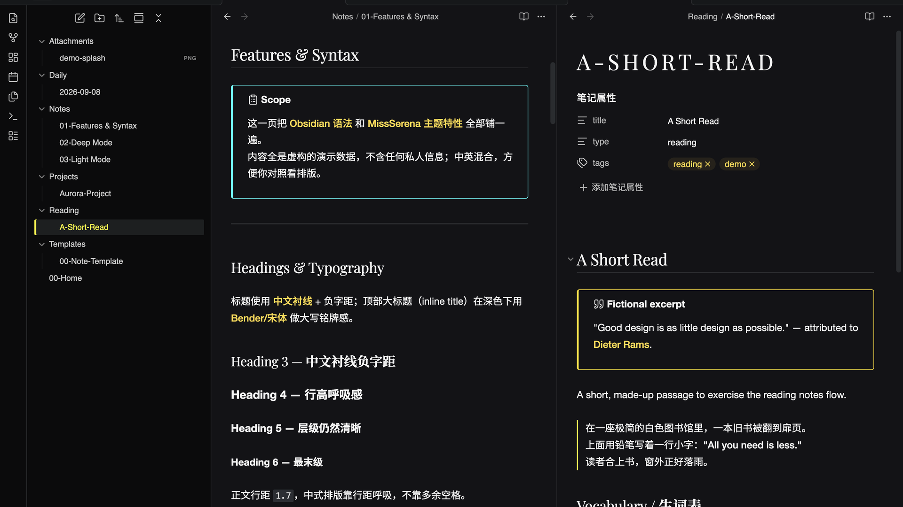
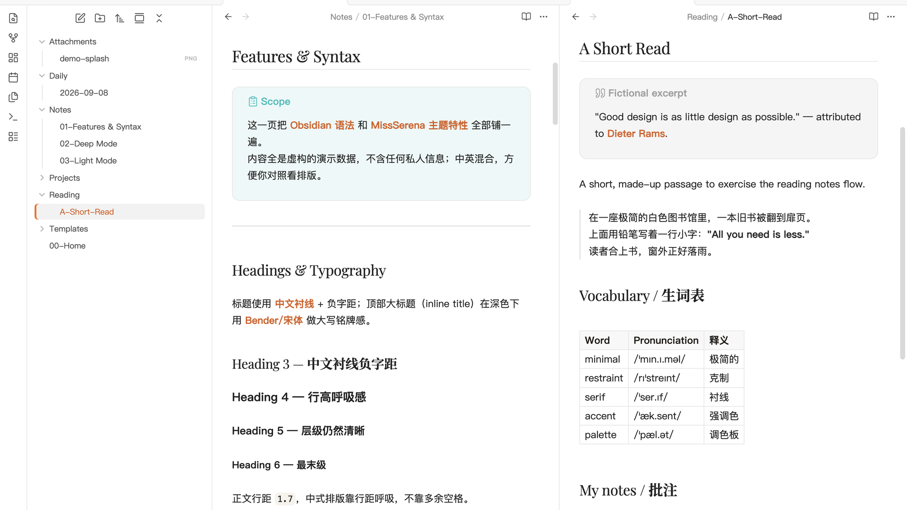

# MissSerena

A dual-mode Obsidian theme inspired by **Hypergryph** studio — the visual language of *Arknights*, *Arknights: Endfield*, and *Ex Astris* (来自星尘). Designed around a black / white / gray base with **one** saturated accent color per mode, GIMP-CMYK-style tricolor accents, serif Chinese headings, and a distinct shape language: **sharp right angles in dark, soft capsule radii in light.**

> Design tokens are extracted from the official websites: `ak.hypergryph.com`, `endfield.hypergryph.com`, and `exa.hypergryph.com`.

## Modes

- **Dark** — *Arknights × Endfield* (industrial / military-instrument)
  - Cold deep-gray base from Endfield `#191919`; hierarchy by lightness, not shadow.
  - Accent: Endfield alert yellow `#fffa00` for interactions / state / selection.
  - Links: Arknights tech cyan `#18d1ff`.
  - Right-angle radii (2–4px). Heading font reverts to a serif / **Bender**.
- **Light** — *Ex Astris* (clean / starry / capsule)
  - A "luxury boutique" four-color system over a Chanel white base:
    - **Chanel black/white** — skeleton (paper & ink)
    - **Chanel gold `#C5A253`** — refinement layer (bold, rules, list markers)
    - **Hermès orange `#F37021`** — action layer (interactions, selection, checkboxes)
    - **Tiffany `#0ABAB5`** — information layer (links, text selection)
    - **Dior pink `#F7CACA`** — soft layer (highlight, tags)
  - Soft capsule radii (button `999px`).

## Highlights

- **Chinese-friendly typography**: `PingFang SC` / `Source Han Sans` interface & body stack, serif headings, adjustable line-height for CJK breathing room (`1.7`), negative tracking on large titles.
- **Tricolor callout system (dark)**: note → cyan, warning → magenta, tip/success/etc. → gold — borders and title/icon colors per callout type, with inner text returning to body color.
- **Nav & tab accent indicators**: left accent bar on active file, bottom accent line on active tab.
- **CMY / alert-yellow accents** tuned for dark readability (desaturated where needed) and **luxury tones** for light-mode legibility.
- **Code & blockquote styling**: distinct base, thin hairline borders, warm gold-paper code block in light mode.
- **Consistent task checkbox radii** and completed-task accent colors across both modes.

## Installation

1. Open **Settings → Appearance → Themes → Manage**.
2. Click **Community themes** and search for **MissSerena**.
3. **Install** and **Use**.

You can also install it manually: copy this folder into your vault's `.obsidian/themes/` directory, then enable it from **Settings → Appearance**.

## Compatibility

- `minAppVersion`: `1.0.0`
- Works in both light and dark modes; follow your system appearance or toggle via **Settings → Appearance**.

## License

Released under the [MIT License](LICENSE). See the license file for details.
